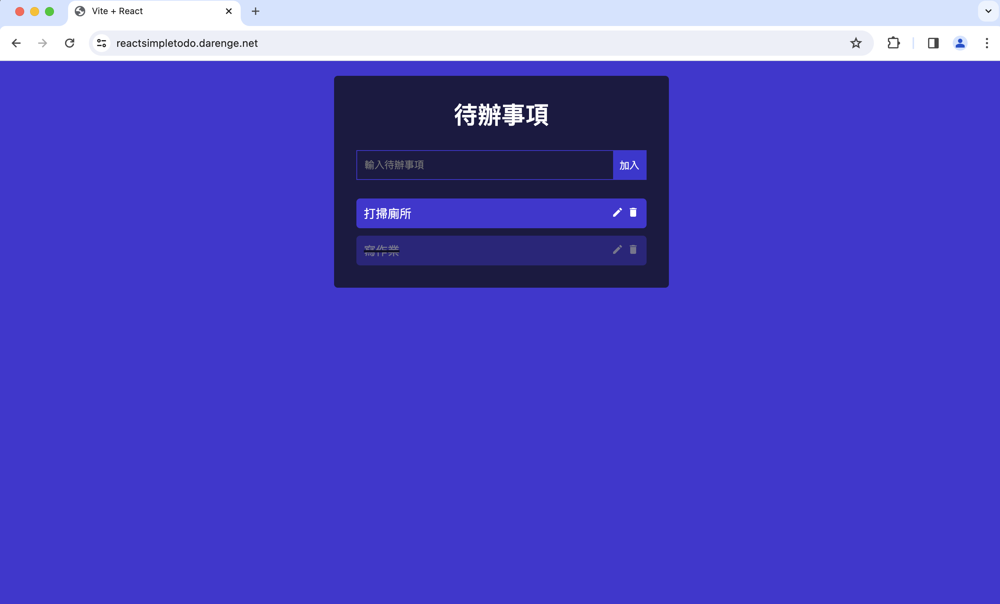

# React快速入門
這是一個由React以及Vite所寫成的簡單todo應用，目的是在幫助初學者學習React。

課程影片：https://www.youtube.com/watch?v=aBTiZfShe-4  

線上Demo：https://reactsimpletodo.darenge.net/





## 安裝步驟

請依序執行以下指令：
```
git clone https://github.com/darenge5965/reactSimpleTodo.git
cd reactSimpleTodo
npm install
npm run dev
```
執行完後vite會啟動開發伺服器，並且terminal會顯示一個localhost的網址，把他貼到瀏覽器上即可。

